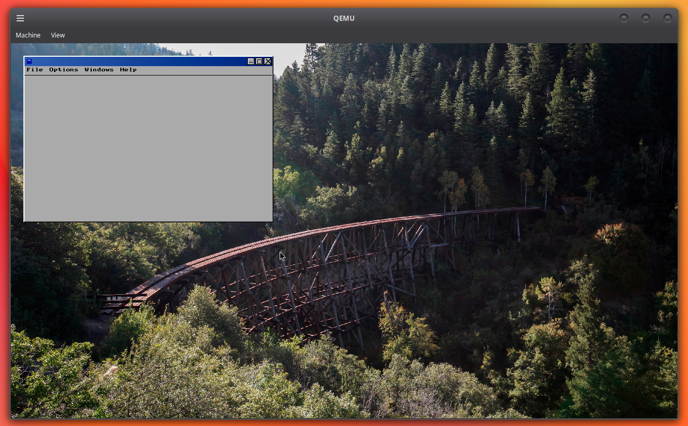

<h2>discouNT operating system</h2>


<br>
<i>discouNT in multi-user mode</i>
<br><br>

discouNT is a from-scratch operating system designed to be compatible with Windows NT.

Although it uses some code from WINE and ReactOS, **it is not a fork of either.**

### LoongArch64 bring-up

The initial LoongArch64 port builds with Clang and LLD and currently reaches an
early serial-console entry point on QEMU's `virt` machine:

```sh
make loongarch64
make run-loongarch64
```

The normal run target opens the 640x480 LA64 framebuffer console. Use
`make -f Makefile.loongarch64 run-headless` for a serial-only terminal.

`make run-loongarch64` uses the generated reset ROM. The separate
`make -f Makefile.loongarch64 run-uefi` target exercises `tools/QEMU_EFI.fd`
with the ELF payload; it is retained for the UEFI handoff work.

The LA64 kernel currently initializes the shared memory, object, I/O, and
executive layers and creates the Session Manager process. CSRSS image loading
and LA64 context switching are the next user-mode bring-up milestones.

discouNT now supports IDE hard drives as well as USB flash drives (still WIP), for installation.
